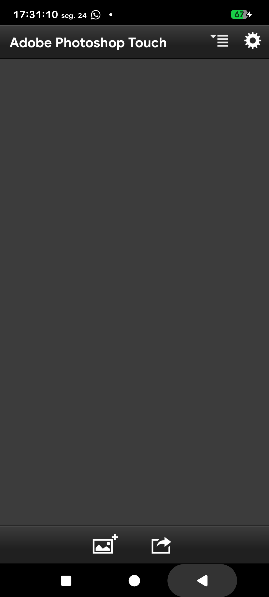
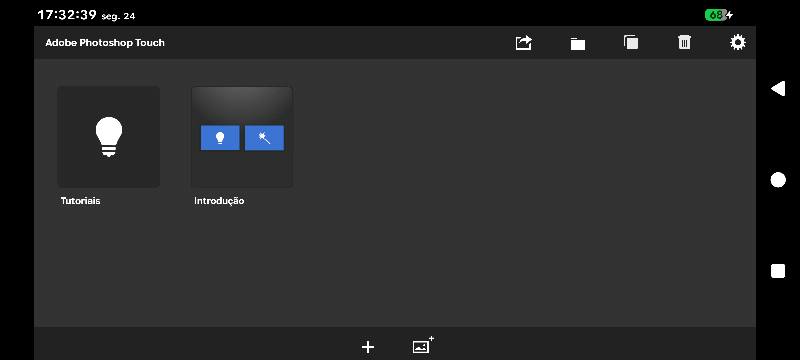

<div align="center">

# 🎨 Photoshop Touch — Port para Android Moderno

**Recuperação técnica do Adobe Photoshop Touch 1.3.7 e 1.7.7 para rodar no Android 10–16**

[](https://github.com/Lord-Philly/photoshop-touch-1.3.7-android-port/releases)
[](#-downloads-e-instalação)
[](#-downloads-e-instalação)
[](https://github.com/Lord-Philly/photoshop-touch-1.3.7-android-port/issues)
[](#-licença)

</div>

---

## 📑 Índice

- [Sobre o projeto](#-sobre-o-projeto)
- [Recursos](#-recursos)
- [Screenshots](#-screenshots)
- [Downloads e instalação](#-downloads-e-instalação)
- [Compilação e desenvolvimento](#️-compilação-e-desenvolvimento)
- [Estrutura do projeto](#-estrutura-do-projeto)
- [Problemas conhecidos](#-problemas-conhecidos)
- [Compatibilidade](#-compatibilidade)
- [Contribuições](#-contribuições)
- [Apoie o projeto](#-apoie-o-projeto)
- [Licença](#-licença)
- [Avisos](#️-avisos)
- [Documentação técnica](#-documentação-técnica)

---

## 📱 Sobre o projeto

O **Adobe Photoshop Touch** foi descontinuado e nunca recebeu suporte a versões modernas do Android: os APKs originais usam um runtime AIR de 2014 (`targetSdk 12`) que o instalador atual bloqueia.

Este projeto é uma **investigação técnica e portabilidade autorizada** desses aplicativos para o Android contemporâneo, em duas frentes:

| Linha | Conteúdo | Estado |
|---|---|---|
| **PS Touch 1.3.7** (phone) | Editor em retrato | ✅ Funcional — Android 16 validado |
| **PS Touch 1.7.7** (tablet) | Versão tablet em paisagem | ✅ Funcional — Android 16 validado |

**Como funciona**: as classes Java e as bibliotecas nativas do runtime AIR legado são substituídas pelo **AIR SDK 51**, mantendo o conteúdo original do aplicativo (SWF, recursos, extensões). O descriptor permanece intocado no disco — um equivalente é fornecido em memória durante o boot (*split-feed*), preservando a integridade da licença. Como o runtime novo não recalcula a composição na orientação travada, um ciclo sintético de eventos (**autocorreção**) corrige o estado da superfície automaticamente.

> 💡 Novo por aqui? Vá direto para [Downloads e instalação](#-downloads-e-instalação) — os ports instalam pelo gerenciador de arquivos normal, sem ferramentas especiais.

---

## ✨ Recursos

### Disponíveis

- [x] Instalação pelo instalador padrão do Android (Android 10–16), sem bypass
- [x] Editor carregando e operacional (criar documento, camadas, filtros)
- [x] `ps137` — abertura em **retrato travado**
- [x] `ps177` — abertura em **paisagem travada**
- [x] Autocorreção de composição no boot e a cada retomada de foco
- [x] Cura manual por toque (rede de segurança)
- [x] Permissão de armazenamento solicitada **uma única vez**
- [x] Os dois ports coexistem instalados no mesmo aparelho
- [x] Camada de compatibilidade ANE em PIC (119 pontos de entrada JNI)

### Em desenvolvimento / validação

- [ ] Validação formal em Android 10–15 ([matriz de compatibilidade](docs/compatibility-matrix.md))
- [ ] Correção dos micro-glitches visuais na navegação de menus

### Planejado

- [ ] Automatizar o pipeline de montagem dos APKs em script único

---

## 📸 Screenshots

| ps137 (retrato) | ps177 (paisagem) |
|---|---|
|  |  |

---

## 📥 Downloads e instalação

Todos os APKs estão na release **[`Ps Touch (versões)`](https://github.com/Lord-Philly/photoshop-touch-1.3.7-android-port/releases/tag/versoes)**:

| Arquivo | O que é | Para quem |
|---|---|---|
| [`ps137.apk`](https://github.com/Lord-Philly/photoshop-touch-1.3.7-android-port/releases/download/versoes/ps137.apk) | PS Touch 1.3.7 com runtime moderno | Android 10–16 |
| [`ps177.apk`](https://github.com/Lord-Philly/photoshop-touch-1.3.7-android-port/releases/download/versoes/ps177.apk) | PS Touch 1.7.7 (tablet) com runtime moderno | Android 10–16 |
| `pstouchbase_1.3.7.apk` | Base original 1.3.7 | Dispositivos antigos |
| `pstouchbase_1.7.7.apk` | Base original 1.7.7 | Dispositivos antigos |

> As **bases originais** têm `targetSdk 12`: em Android moderno só instalam via ferramentas que contornam o bloqueio do instalador (ex.: MT Manager). Nos dispositivos antigos elas são o app normal de sempre.

### Instalando um port

1. Desinstale qualquer build anterior **do mesmo pacote**;
2. Toque no APK baixado e confirme a instalação pelo instalador padrão;
3. Abra o app e conceda a permissão de armazenamento quando pedida (**aparece uma única vez**);
4. Pronto — `ps137` abre em pé, `ps177` abre deitado, ambos com a orientação fixa.

> 💡 `ps137` e `ps177` usam pacotes Android diferentes (`air.com.adobe.pstouchphone` e `air.com.adobe.pstouch`) e **podem ficar instalados juntos**.

> ℹ️ Hashes SHA-256 de todos os artefatos em [`docs/version-matrix.md`](docs/version-matrix.md). O APK original da Adobe também está arquivado na release [`v1.3.7-original`](https://github.com/Lord-Philly/photoshop-touch-1.3.7-android-port/releases/tag/v1.3.7-original) para referência de análise.

---

## 🛠️ Compilação e desenvolvimento

Este repositório documenta e automatiza partes do processo — **os binários proprietários da Adobe não estão incluídos** e devem ser obtidos separadamente pelo desenvolvedor.

### Pré-requisitos

- APK original decodificado (ex.: via apktool) — *não distribuído aqui*
- [Android NDK 25.2](https://developer.android.com/ndk) para a camada ANE
- PowerShell (scripts de análise/preparação foram escritos para Windows/Termux)

### 1. Inspecionar um APK (somente leitura)

```powershell
.\scripts\inspect-apk.ps1 `
  -ApkPath 'C:\caminho\para\pstouchbase_1.3.7.apk'
```

Calcula o SHA-256, lista o conteúdo do ZIP/APK e gera relatório em `analysis-output/`. Não modifica nada.

### 2. Preparar um projeto decodificado para runtime moderno

```powershell
.\scripts\prepare-modern-poc.ps1 `
  -DecodedProject 'C:\caminho\projeto-decodificado' `
  -OutputProject 'C:\caminho\projeto-moderno' `
  -TargetSdk 35 -VersionCode 1003008 -VersionName '1.3.7-modern-poc'
```

### 3. Compilar a camada de compatibilidade ANE (PIC)

Com NDK 25.2 instalado:

```powershell
& "$env:ANDROID_HOME\ndk\25.2.9519653\ndk-build.cmd" `
  NDK_PROJECT_PATH="$PWD\native\ane-compat" `
  APP_BUILD_SCRIPT="$PWD\native\ane-compat\Android.mk" `
  NDK_APPLICATION_MK="$PWD\native\ane-compat\Application.mk"
```

Substitui a biblioteca original `TTPixelExtensionAndroid` (que contém `DT_TEXTREL`, rejeitada por linkers recentes) por uma reimplementação *clean-room* dos mesmos 119 pontos de entrada JNI.

### 4. Montagem final dos APKs

O empacotamento final (troca de dex/libs, patch binário do manifesto, assinatura) ainda é feito manualmente com apktool/apksigner seguindo os procedimentos descritos na [documentação técnica](#-documentação-técnica) — a automação em script único está [planejada](#-recursos).

---

## 📂 Estrutura do projeto

```text
/
├── docs/
│   ├── images/                  # screenshots dos ports
│   ├── initial-apk-autopsy.md   # primeira autópsia do APK original
│   ├── deep-autopsy.md          # análise profunda do runtime legado
│   ├── air51-modern-poc.md      # PoC da troca para o AIR 51
│   ├── orientation-heal-poc.md  # trava de orientação + autocorreção
│   ├── compatibility-matrix.md  # matriz Android 10–16
│   ├── test-results-android16.md # resultados do teste real
│   ├── version-matrix.md        # catálogo das builds publicadas
│   ├── public-release.md        # registro do APK original
│   ├── porting-plan.md          # fases e critérios de decisão
│   └── prompt-for-dev.md        # briefing operacional p/ dev ou IA
├── native/
│   └── ane-compat/              # camada PIC p/ contratos JNI das ANEs
├── scripts/
│   ├── inspect-apk.ps1          # inspeção reproduzível e não destrutiva
│   └── prepare-modern-poc.ps1   # preparação do projeto decodificado
├── .github/
│   ├── ISSUE_TEMPLATE/          # templates de issue
│   └── CONTRIBUTING.md          # guia de contribuição
├── SECURITY.md                  # política de segurança e artefatos
└── README.md
```

---

## 🐛 Problemas conhecidos

| Problema | Impacto | Status |
|---|---|---|
| Micro-glitches visuais ao navegar menus e tocar botões | Cosmético | Investigação |
| Bases originais (`pstouchbase_*`) não instalam normalmente em Android moderno | Limitação do `targetSdk 12` — usar MT Manager ou os ports | Esperado/comportamento histórico |
| Android 10–15 sem validação formal dos ports | Matriz de compatibilidade pendente | Aceitando testes |
| Biblioteca original `TTPixelExtensionAndroid` tem `DT_TEXTREL` | Rejeitada por linkers novos — resolvido pela camada PIC | Resolvido |

Encontrou algo novo? [Abra uma issue](https://github.com/Lord-Philly/photoshop-touch-1.3.7-android-port/issues/new?template=bug_report.md).

---

## 🗺️ Compatibilidade

Prioridade máxima: **Android 16 (API 36)** — validado em Redmi Note 9S (ARM64 executando libs ARMv7). Demais versões (10–15) aguardam testes da comunidade:

| Android | Status |
|---|---|
| 16 (API 36) | ✅ Instalação normal, editor operacional |
| 10–15 (API 29–35) | ⏳ Pendente de teste |

Critérios de aprovação, detalhes por dispositivo e instruções de teste em [`docs/compatibility-matrix.md`](docs/compatibility-matrix.md).

---

## 💡 Contribuições

Toda contribuição é bem-vinda! Você pode ajudar assim:

- 🐞 **Reportando bugs** — use o [template de bug report](https://github.com/Lord-Philly/photoshop-touch-1.3.7-android-port/issues/new?template=bug_report.md) com dispositivo, versão do Android e logs;
- 📱 **Testando em aparelhos** — principalmente Android 10–15, preenchendo a [matriz de compatibilidade](docs/compatibility-matrix.md);
- 💡 **Sugerindo melhorias** — via [template de feature request](https://github.com/Lord-Philly/photoshop-touch-1.3.7-android-port/issues/new?template=feature_request.md);
- 📝 **Melhorando a documentação** — correções, clareza, traduções;
- 🔧 **Código** — camada ANE, scripts de automação: veja o [guia de contribuição](.github/CONTRIBUTING.md).

---

## 💰 Apoie o projeto

Se você gosta deste projeto e quer ajudar na continuidade do desenvolvimento deste e de futuros projetos, qualquer contribuição será muito bem-vinda. ❤️

Também fique à vontade para deixar comentários, sugestões de melhorias ou ideias de novos recursos. Toda contribuição da comunidade ajuda o projeto a evoluir.

### PIX

**Chave PIX:**

```text
philly.weird@gmail.com
```

> Copie a chave acima e cole no seu app de banco. Obrigado pela ajuda! 🙏

---

## 📜 Licença

**Nenhuma licença de código aberto foi definida ainda** para a documentação e o código deste repositório — até que haja uma decisão explícita, o conteúdo padrão de direitos autorais se aplica e o reutilização requer autorização do autor.

O **Photoshop Touch** e todos os componentes proprietários relacionados são **© Adobe**. Este repositório não os redistribui nem reivindica qualquer direito sobre eles; os APKs originais são arquivados apenas como referência de análise, com origem registrada.

---

## ⚠️ Avisos

- Este é um projeto **independente e educacional/preservacionista**. Não representa, endossa ou tem qualquer afiliação com a **Adobe** ou qualquer outro detentor de direitos.
- O aplicativo Photoshop Touch está **descontinuado**; este trabalho visa preservar funcionalidade em hardware moderno para uso pessoal de quem possua o app legitimamente.
- É proibido usar este projeto para burlar DRM, licenciamento, autenticação ou serviços remotos — veja a [política de segurança](SECURITY.md).
- Teste somente em dispositivos para os quais você tenha autorização.

---

## 📚 Documentação técnica

| Documento | Conteúdo |
|---|---|
| [`initial-apk-autopsy.md`](docs/initial-apk-autopsy.md) | Primeira autópsia: estrutura, permissões, ANEs do APK original |
| [`deep-autopsy.md`](docs/deep-autopsy.md) | Análise profunda do runtime AIR legado |
| [`air51-modern-poc.md`](docs/air51-modern-poc.md) | Troca do runtime para AIR 51 e bloqueio das ANEs |
| [`orientation-heal-poc.md`](docs/orientation-heal-poc.md) | Trava de orientação, causa raiz da composição quebrada e ciclo de autocorreção |
| [`test-results-android16.md`](docs/test-results-android16.md) | Resultados do teste real em Android 16 |
| [`compatibility-matrix.md`](docs/compatibility-matrix.md) | Matriz de compatibilidade Android 10–16 |
| [`version-matrix.md`](docs/version-matrix.md) | Catálogo completo das builds e hashes |
| [`public-release.md`](docs/public-release.md) | Registro do APK original na release |
| [`porting-plan.md`](docs/porting-plan.md) | Plano de fases e critérios de decisão |
| [`prompt-for-dev.md`](docs/prompt-for-dev.md) | Briefing operacional para devs ou IA |
| [`native/ane-compat/README.md`](native/ane-compat/README.md) | Camada de compatibilidade ANE (clean-room, PIC) |

---

<div align="center">

**Photoshop Touch Android Port** · feito pela comunidade, para preservar um clássico 🎨

[⬆ Voltar ao índice](#-índice)

</div>
